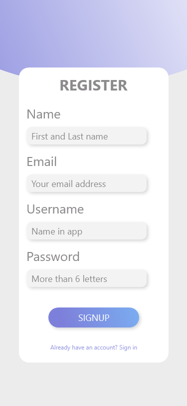
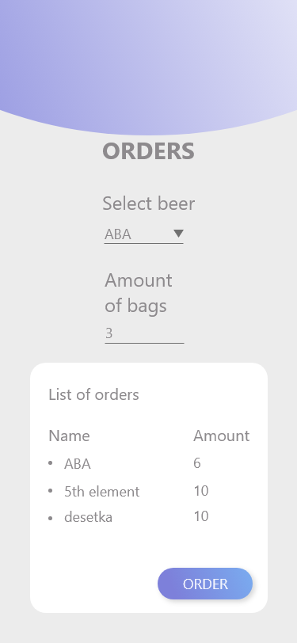

# BeerStorageManager

Android app for managing storage of a Brewery.

# Design of a application

Here you can see how application should/will look after is finished.

* Home screen

* Login screen

* Register screen

* Orders screen

* Storage screen

* Preset screen

